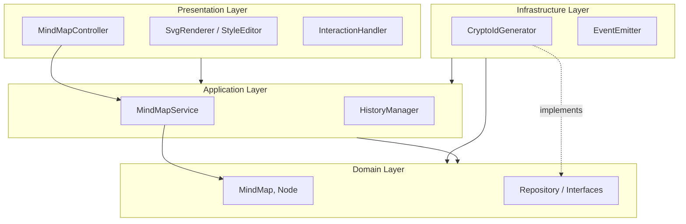
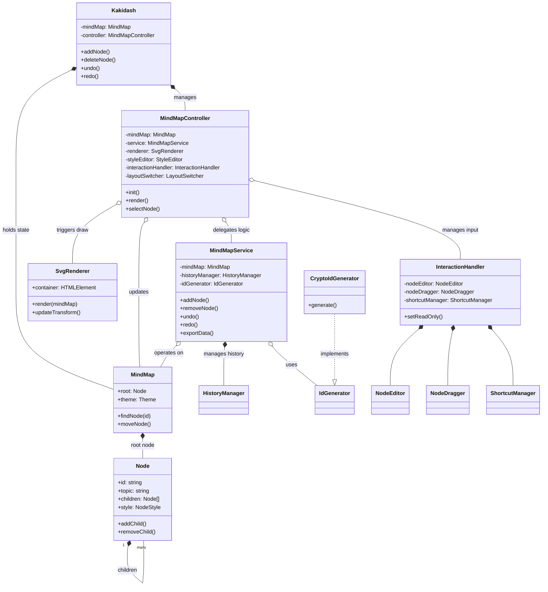

# Kakidash Software Architecture Design

## 1. Architecture Overview

Kakidash is designed based on **Clean Architecture** principles to enhance maintainability, testability, and extensibility.
Following the dependency rule, outer layers (Presentation, Infrastructure) depend on inner layers (Domain, Application).

### 1.1 Dependency Graph (Layers)



### 1.2 Module/Class Dependency Diagram

This diagram shows concrete relations between major classes.




## 2. Directory Structure

The source code is organized into directories based on layer responsibilities.

```
src/
├── domain/           # Domain Layer (Entities, Interfaces)
│   ├── entities/     # Core business logic entities
│   └── interfaces/   # Interfaces for repositories and services
├── application/      # Application Layer (Use Cases, Services)
│   └── services/     # Application specific business rules
├── presentation/     # Presentation Layer (UI, Controller, Handlers)
│   ├── components/   # UI components (Renderer, Editor)
│   └── logic/        # User interaction handling
├── infrastructure/   # Infrastructure Layer (Implementations)
│   └── impl/         # Implementation of external interfaces
└── index.ts          # Entry point (Dependency Injection)
```

## 3. Layer Details

### 3.1 Domain Layer (`src/domain`)
The core of business logic. Has no external dependencies.

- **Entities**: 
  - `MindMap`: Root entity managing the entire mind map.
  - `Node`: Data structure and behavior for each node (parent-child relationship management, etc.).
- **Interfaces**:
  - `IdGenerator`: Abstraction interface for ID generation.
  - `MindMapData`: Type definitions for data export/import.
  - `MindMapStyles`: Type definitions for style settings.

### 3.2 Application Layer (`src/application`)
Orchestrates domain entities to implement application use cases.

#### Services (`src/application/services`)
- **MindMapService**:
  - Implements major use cases such as adding, deleting, moving, and editing nodes.
  - Coordinates with history management (Undo/Redo).
- **HistoryManager**:
  - Manages operation history using the Memento pattern.

### 3.3 Presentation Layer (`src/presentation`)
Handles user interface and user input.

#### Logic (`src/presentation/logic`)
- **MindMapController**:
  - Receives events from the View and invokes Application Service.
  - Acts as the Controller in the MVC pattern.
- **InteractionHandler**:
  - Handles user inputs such as mouse operations, keyboard shortcuts, and drag-and-drop.

#### Components (`src/presentation/components`)
- **SvgRenderer**:
  - Responsible for SVG rendering of the mind map.
- **NodeEditor / StyleEditor**:
  - Separates complex UI logic for node editing and styling.

### 3.4 Infrastructure Layer (`src/infrastructure`)
Provides concrete implementations for interfaces defined in domain and application layers.

#### Implementations (`src/infrastructure/impl`)
- **CryptoIdGenerator**:
  - Implementation of ID generation using Web Crypto API. Implements `domain/interfaces/IdGenerator`.
- **EventEmitter**:
  - Implementation of the event bus.

## 4. Entry Point and DI (`src/index.ts`)
Instantiates components and injects dependencies upon application startup.

```typescript
// DI Example
const idGenerator = new CryptoIdGenerator(); // Infrastructure
const mindMap = new MindMap(rootNode);       // Domain
const service = new MindMapService(mindMap, idGenerator); // Application <- Domain, Infrastructure
const controller = new MindMapController(mindMap, service, renderer, ...); // Presentation <- Application
```

## 5. Key Design Principles

- **Dependency Inversion Principle (DIP)**:
  - High-level modules (Service) do not depend on low-level modules (Infrastructure) but on abstractions (Interfaces) (e.g., `IdGenerator`).
- **Single Responsibility Principle (SRP)**:
  - Each class has a single responsibility (e.g., `MindMapService` for logic, `SvgRenderer` for rendering).
- **DRY (Don't Repeat Yourself)**:
  - Extraction of common logic (e.g., ID generation, style definitions).
- **Type Safety**:
  - Ensuring compile-time safety by eliminating `any` types and using strict type definitions.
