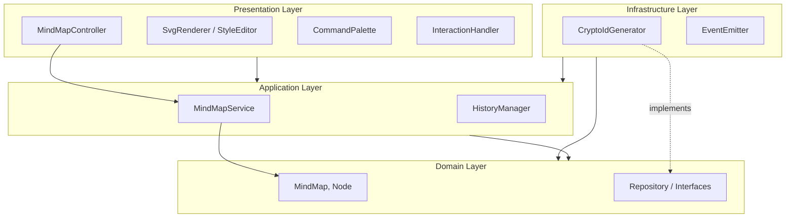
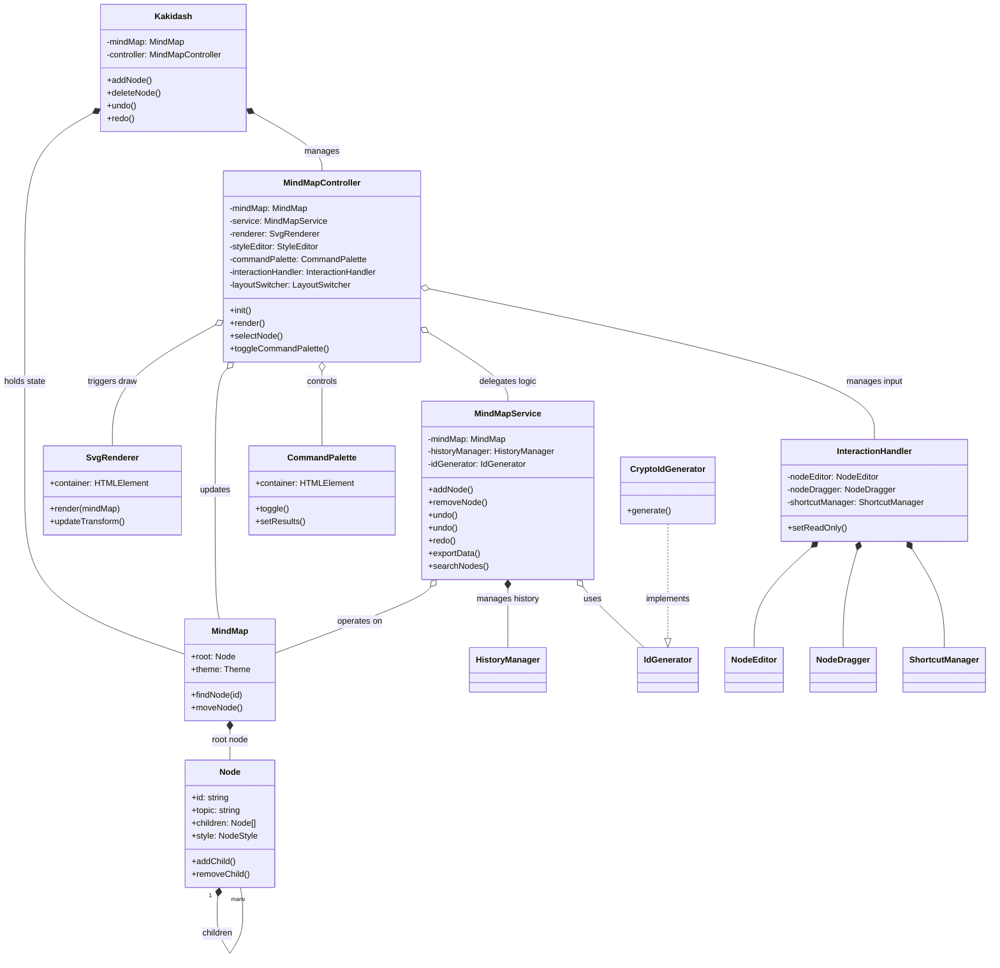
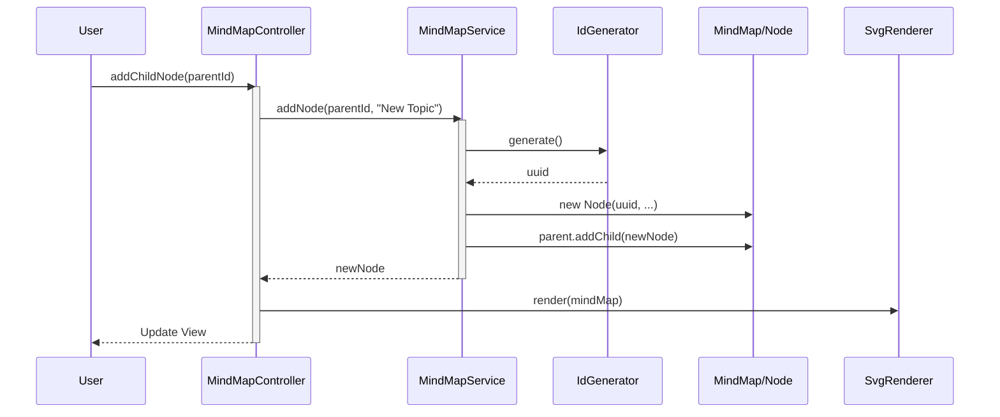
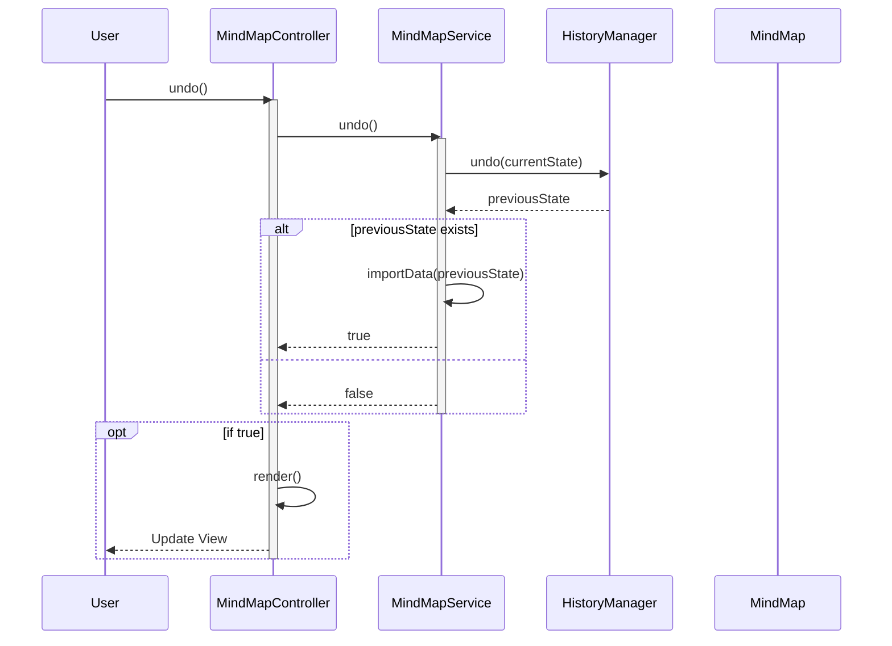
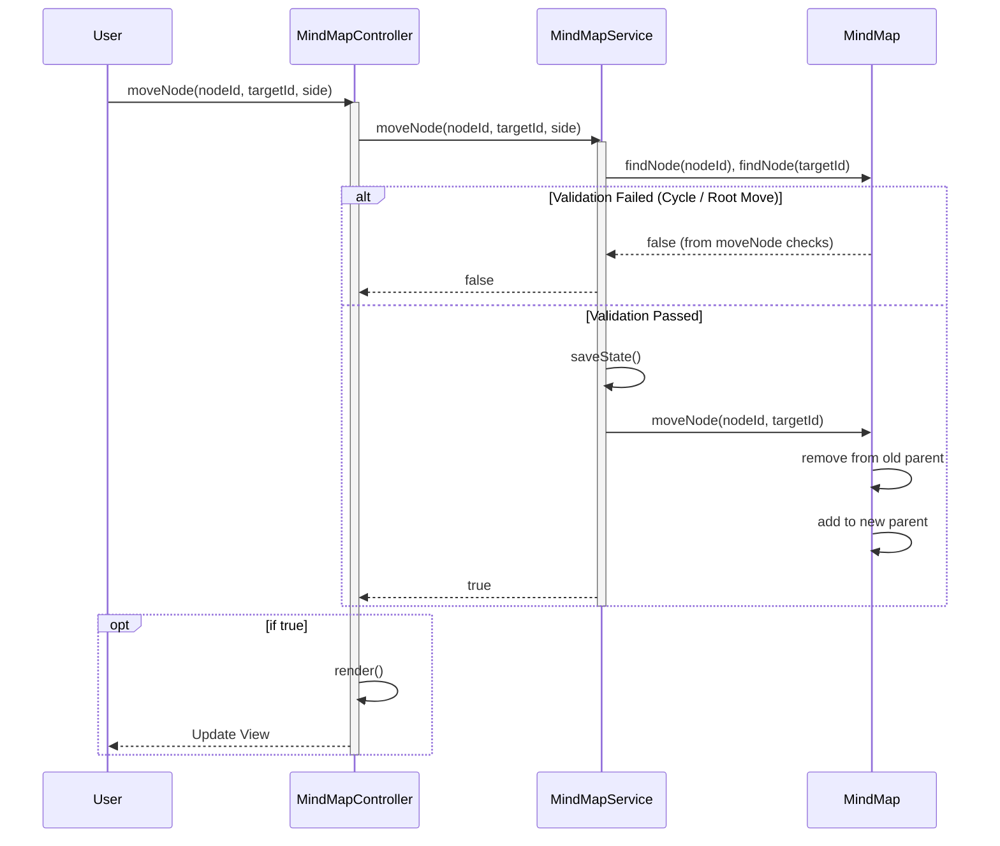
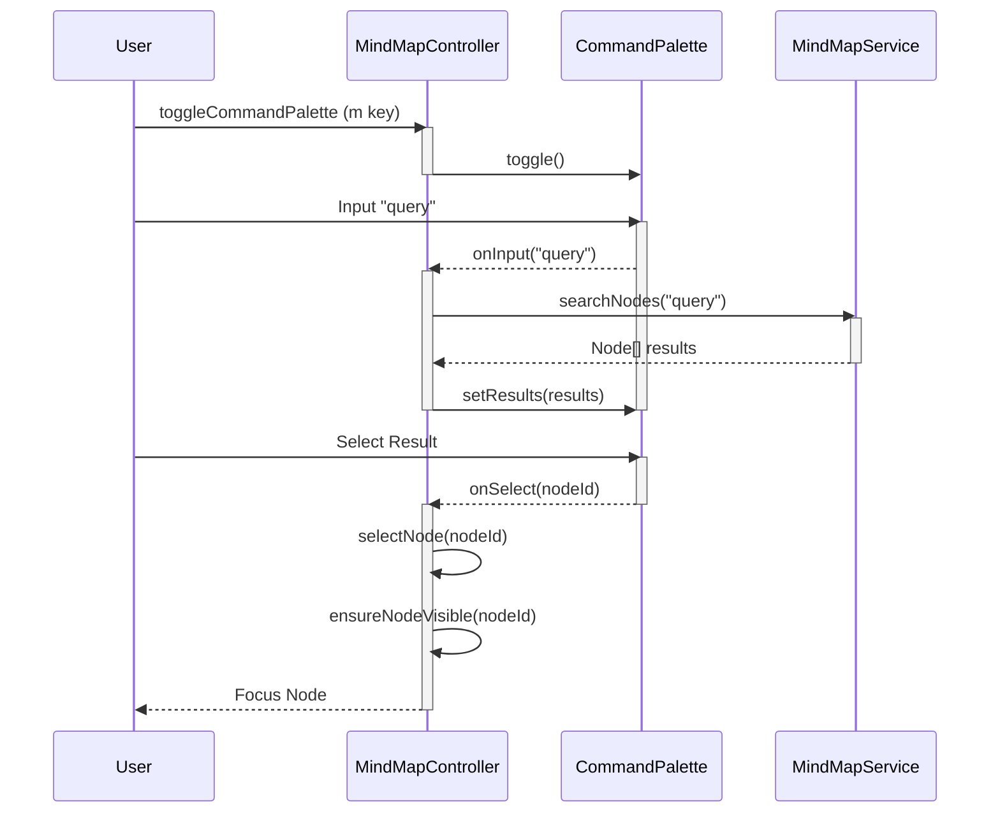

# Kakidash ソフトウェアアーキテクチャ設計書

## 1. アーキテクチャ概要

Kakidashは、メンテナンス性、テスト容易性、拡張性を高めるために **Clean Architecture（クリーンアーキテクチャ）** の原則に基づいて設計されています。
依存関係のルールに従い、外側のレイヤー（Presentation, Infrastructure）が内側のレイヤー（Domain, Application）に依存する形をとっています。

### 1.1 依存関係図 (レイヤー)



### 1.2 モジュール/クラス依存関係図

主要なクラス間の具体的な関係を示す図です。




## 2. ディレクトリ構造

ソースコードは各レイヤーごとの責務に基づいてディレクトリ分割されています。

```
src/
├── domain/           # ドメイン層 (Entities, Interfaces)
│   ├── entities/     # ビジネスロジックの中核となる実体
│   └── interfaces/   # リポジトリやサービスのインターフェース定義
├── application/      # アプリケーション層 (Use Cases)
│   └── services/     # アプリケーション固有のビジネスルール
├── presentation/     # プレゼンテーション層 (UI, Controller)
│   ├── components/   # UIコンポーネント (Renderer, Editor)
│   └── logic/        # ユーザー操作ハンドリング
├── infrastructure/   # インフラストラクチャ層 (External Interfaces)
│   └── impl/         # 外部ライブラリやブラウザAPIの実装
└── index.ts          # エントリーポイント (Dependency Injection)
```

## 3. レイヤー詳細

### 3.1 Domain Layer (`src/domain`)
ビジネスロジックの中核です。外部への依存を持ちません。

- **Entities**: 
  - `MindMap`: マインドマップ全体を管理するルートエンティティ。
  - `Node`: 各ノードのデータ構造と振る舞い（親子関係の管理など）。
- **Interfaces**:
  - `IdGenerator`: ID生成の抽象化インターフェース。
  - `MindMapData`: データエクスポート/インポート用の型定義。
  - `MindMapStyles`: スタイル設定の型定義。

### 3.2 Application Layer (`src/application`)
ドメイン層のエンティティを調整し、アプリケーションとしてのユースケースを実現します。

#### Services (`src/application/services`)
- **MindMapService**:
  - ノードの追加、削除、移動、編集などの主要なユースケースを実装。
  - アクションの履歴管理（Undo/Redo）との連携。
- **HistoryManager**:
  - Mementoパターンを用いた操作履歴の管理。

### 3.3 Presentation Layer (`src/presentation`)
ユーザーインターフェースとユーザー入力を処理します。

#### Logic (`src/presentation/logic`)
- **MindMapController**:
  - Viewからのイベントを受け取り、Application Serviceを呼び出す。
  - MVCパターンのControllerの役割。
- **InteractionHandler**:
  - マウス操作、キーボードショートカット、ドラッグ＆ドロップなどのユーザー入力をハンドリング。

#### Components (`src/presentation/components`)
- **SvgRenderer**:
  - マインドマップのSVG描画を担当。
- **NodeEditor / StyleEditor**:
  - ノード編集やスタイル編集などの複雑なUIロジックの分離。
- **CommandPalette**:
  - `m`キーなどで呼び出し可能なコマンド兼検索パレット。
  - ノード検索結果の表示とナビゲーションを提供。

### 3.4 Infrastructure Layer (`src/infrastructure`)
ドメインやアプリケーション層で定義されたインターフェースの具体的な実装を提供します。

#### Implementations (`src/infrastructure/impl`)
- **CryptoIdGenerator**:
  - Web Crypto APIを使用したID生成の実装。`domain/interfaces/IdGenerator`の実装。
- **EventEmitter**:
  - イベントバスの実装。

## 4. 主要な処理シーケンス

### 4.1 ノード追加フロー

ユーザーがノードを追加する際の、各レイヤー間の相互作用を示します。



### 4.2 Undo/Redo フロー

Mementoパターンを使用した履歴管理と状態復元の流れを示します。



### 4.3 ノード移動フロー (Drag & Drop)

ノード移動時の検証と実行フローを示します。



### 4.4 検索とコマンドパレットフロー

ユーザーが検索を行う際のフローです。



## 5. エントリーポイントとDI (`src/index.ts`)
アプリケーションの起動時に各コンポーネントのインスタンス化と依存性の注入（Dependency Injection）を行います。

```typescript
// DIの例
const idGenerator = new CryptoIdGenerator(); // Infrastructure
const mindMap = new MindMap(rootNode);       // Domain
const service = new MindMapService(mindMap, idGenerator); // Application <- Domain, Infrastructure
const controller = new MindMapController(mindMap, service, renderer, ...); // Presentation <- Application
```

## 6. 主要な設計原則

- **依存性逆転の原則 (DIP)**:
  - 上位モジュール（Service）は下位モジュール（Infrastructure）に依存せず、抽象（Interface）に依存しています（例: `IdGenerator`）。
- **単一責任の原則 (SRP)**:
  - 各クラスは単一の責務を持ちます（例: `MindMapService`はロジック、`SvgRenderer`は描画）。
- **DRY (Don't Repeat Yourself)**:
  - 共通ロジックの抽出（例: ID生成、スタイル定義）。
- **型安全性**:
  - `any`型の排除と厳密な型定義によるコンパイル時の安全性確保。
